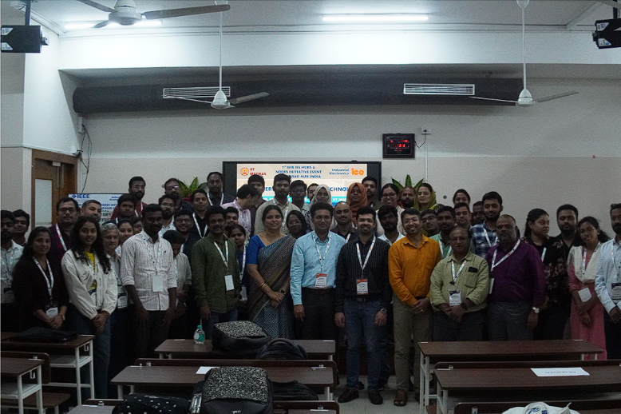

# Chennai Event – EV Battery & Charging Technology Workshop

## Overview
A two‑day technical workshop focused on **electric vehicle battery systems**, charging infrastructure, and emerging EV technologies.  
The programme combined industry‑oriented technical sessions with academic interaction to promote awareness and practical exposure.

---

## Key Themes
- Sustainable transportation technologies  
- EV ecosystem challenges  
- Industry requirements and practical exposure  
- IEEE IES engagement opportunities  

---

## Event Impact
- **289 participants engaged**  
- **7 new student members** joined IEEE IES  
- **Madras IEEE IES Chapter revitalized**  
- **New IEEE IES Student Branch Chapter inaugurated**  

This activity significantly strengthened IEEE IES visibility in the Chennai region while supporting membership growth, chapter development, and sustainable regional engagement under the IEEE IES Hubs & Nodes Initiative.

---

## Featured
The Chennai event was highlighted in the **IEEE IES ITEN Newsletter**. 
[Read the Chennai Event Article](https://iten.ieee-ies.org/)  

---

## Event Photo

*(Place the actual group photo in your repo under `assets/chennai_event.jpg`)*

---

## 🌟 Contribution to Hub Vision
This workshop aligned with the Hyderabad Hub’s vision of building sustainable ecosystems by connecting academia, industry, Young Professionals, and global IEEE IES communities through meaningful technical engagement.
