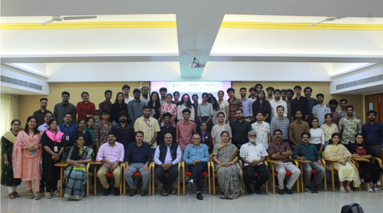

# Kochi Event – Faculty Development Programme

## Overview
A six‑day **Faculty Development Programme (FDP)** conducted in hybrid mode, focused on **AIoT‑enabled activity‑based engineering education**, embedded systems integration, and industry‑oriented learning approaches.

---

## Key Themes
- Hands‑on MATLAB, Arduino, and Raspberry Pi sessions  
- AIoT and sensor‑based applications  
- Industry interaction and industrial visits  
- IEEE IES leadership engagement  
- Professional networking and collaboration opportunities  

---

## Event Impact
The FDP strengthened awareness about:
- IEEE IES opportunities  
- Experiential learning methodologies  
- Innovation‑driven engineering education ecosystems  

---

## Featured
This event is scheduled to be featured in the **IEEE IES ITEN Newsletter** (publication pending).

---

## Event Photo

*(Place the actual group photo in this repo under `assets/kochi_event.jpg`)*

---

## 🌟 Contribution to Hub Vision
This programme aligned with the Hyderabad Hub’s vision of building sustainable ecosystems by connecting academia, industry, Young Professionals, and global IEEE IES communities through meaningful technical engagement.
