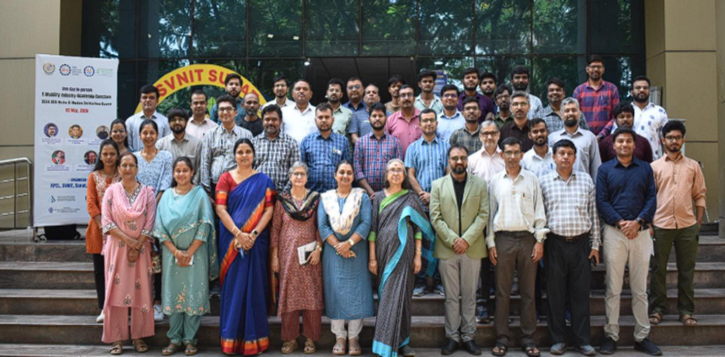

# Surat Event – E‑Mobility Industry‑Academia Conclave

## Overview
A one‑day conclave organized at **SVNIT Surat**, focusing on **electric mobility**, industrial electronics, and industry‑academia collaboration.  
The event brought together IEEE IES leadership, industry experts, and academia to discuss challenges and opportunities in the EV ecosystem.

---

## Key Themes
- IEEE IES leadership interaction  
- EV ecosystem discussions  
- Industry expert sessions  
- Professional networking  
- Awareness about IEEE IES conferences, technical committees, global opportunities, and the Hubs & Nodes Initiative  

---

## Event Impact
The conclave successfully strengthened IEEE IES visibility and collaboration within the Gujarat region, creating new opportunities for students, researchers, and professionals.

---

## Featured
This event is scheduled to be featured in the **IEEE IES ITEN Newsletter** (publication pending).

---

## Event Photo

*(Place the actual group photo in this repo under `assets/surat_event.jpg`)*

---

## 🌟 Contribution to Hub Vision
This conclave aligned with the Hyderabad Hub’s vision of building sustainable ecosystems by connecting academia, industry, Young Professionals, and global IEEE IES communities through meaningful technical engagement.
