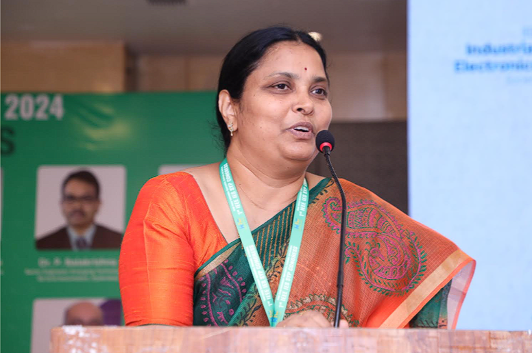

# Leadership

## Dr. Tripura Pidikiti

**Hyderabad Hub Leader – IEEE IES Hubs & Nodes Initiative**  
**AdCom Member-at-Large, IEEE Industrial Electronics Society (IES), RVR & JC College of Engineering, Guntur**

Dr. Tripura Pidikiti serves as the Hyderabad Hub Leader under the IEEE Industrial Electronics Society (IES) Hubs & Nodes Initiative. She is actively involved in strengthening regional IEEE IES engagement through:

- Industry-academia collaboration  
- Young Professional development  
- Membership growth  
- Sustainable technical ecosystems  

She is currently working toward expanding IEEE IES activities across multiple regions through collaborative technical events, industry interaction, faculty development programmes, student engagement initiatives, and regional networking platforms.

---

## Focus Areas
- Electric Mobility and Sustainable Energy Systems  
- Industrial Electronics and Automation  
- AIoT and Embedded Technologies  
- Industry-Academia Collaboration  
- Renewable Energy Systems and Smart Grids  
- Young Professional Engagement and Leadership Development  
- IEEE Student Branch and Chapter Growth  

---

## Collaboration Network
Through the Hyderabad Hub, she actively coordinates with:
- IEEE IES leadership  
- Technical Committee Chairs  
- Industry experts  
- IES Chapter leaders  
- Academic institutions  
- IEEE volunteers and Student Branches  

This collaboration strengthens global IEEE IES visibility and creates meaningful opportunities for students, researchers, faculty members, and Young Professionals.

---

## Regional Initiatives
Dr. Tripura Pidikiti has been actively involved in organizing and supporting:
- Faculty Development Programmes  
- Industry Conclaves  
- EV Technology Workshops  
- Renewable Energy Workshops  
- IEEE IES Connect Sessions  
- Membership and Leadership Engagement Activities  

Each initiative emphasizes measurable impact, industry participation, and sustainable regional growth.

---

## 🌟 Leadership Vision
> *“Building sustainable regional ecosystems that connect academia, industry, Young Professionals, and global IEEE IES communities through meaningful technical engagement and collaboration.”*
